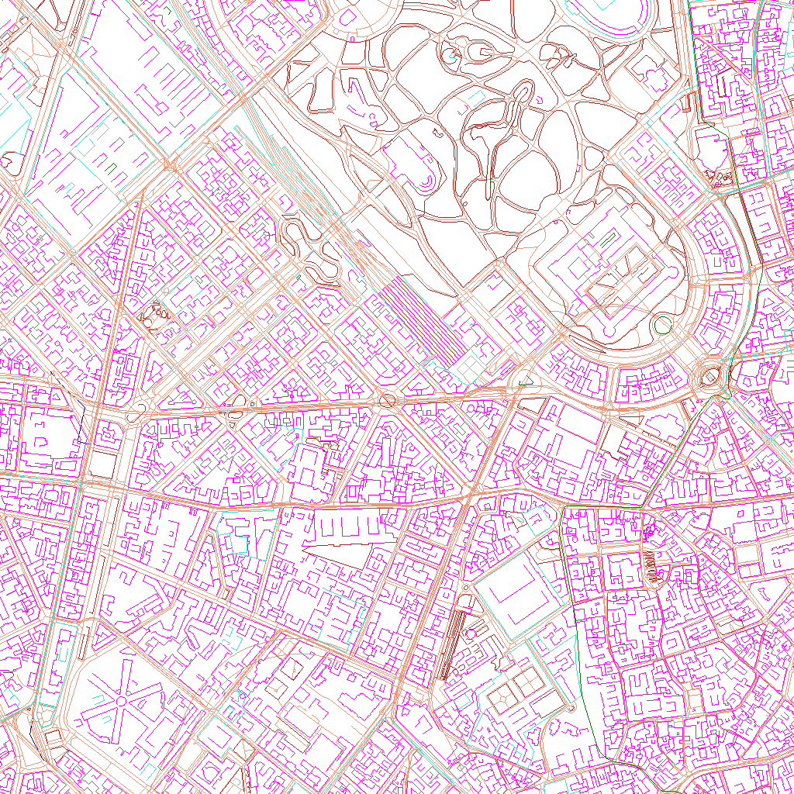

This project renders MapBox vector tiles using Python.

This code is able to render a given tile file in a very simple way (see the image) to give an idea of the content.

# What is a vector tile
The vector tile specifications are here: https://github.com/mapbox/vector-tile-spec/tree/master/2.1

In short, a vector tile is a Protobuf file representing a specific area at a specific level of zoom, sometimes the tools generate a SQLite file containing these tiles instead of generating many files. Also, sometimes the tiles are compressed using gzip; sometimes they are compressed AND stored in SQLite.

This project handles __version 2.1__ of the format, it was released in 2016 and now in 2022 is still the latest one, so essentially is the one found everywhere.

The link above explains in detail the content of a tile and how it represents data.

## Tile coordinates

An article detailing the numbers associated with a tile is available here: https://www.maptiler.com/google-maps-coordinates-tile-bounds-projection/

In short, zoom level 0 contains a single tile covering the whole Earth surface (up to 85 degress away from the equator), and each level splits the previous one in 2 on both directions, so at a level Z you have `4^Z` distinct tiles.

OpenStreetMap and MapBox represent tiles using what in the article above is called "Google", which differs from the TileMapService (TMS) specification only in the orientation of the Y axis, the formula `(2**zoom - 1) - ty` calculates it from TMS coordinates. Z and X stay the same.

TMS places the origin on the bottom left corner (like a cartesian plane) and most libraries use the top left corner (as is common in computer graphics).

For example, the WGS84 coordinates of the Sforza castle in Milan, Italy, are `45°28'10,62" N 9°10'48,14" E`. At zoom level 14 this corresponds to `14/8609/5863` in "Google" coordinate (and you can see these values in the tile filenames fetched by OSM and MB maps when zooming there), and `14/8609/10520` using the TileMapService standard. Pretty much every library I found uses the first one, with Leaflet you can specify `tms:true` or use a `-y` in the URL template to handle the TMS coordinates.

# Protobuf
At this address there's the MapBox protobuf schema:
https://github.com/mapbox/vector-tile-spec/blob/master/2.1/vector_tile.proto

